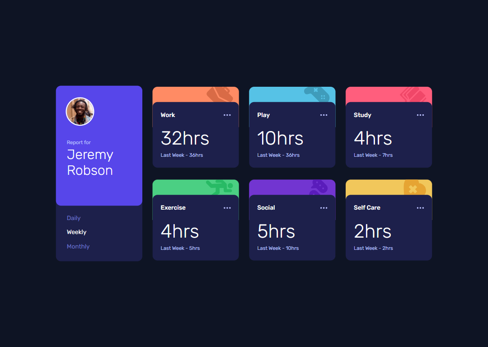

# Time Tracking Dashboard | Frontend Mentor

**Challenge 15**

This is a solution to the [Time tracking dashboard challenge on Frontend Mentor](https://www.frontendmentor.io/challenges/time-tracking-dashboard-UIQ7167Jw). Frontend Mentor challenges help you improve your coding skills by building realistic projects. 

---

## 📚 Table of contents

- [🔎 Overview](#-overview)
  - [🎯 The challenge](#-the-challenge)
  - [📸 Screenshot](#-screenshot)
  - [🔗 Links](#-links)
  - [🛠️ Built with](#️-built-with)
- [🧠 My process](#-my-process)
  - [🔙 Previous Challenge](#-previous-challenge)
  - [🔜 Next Challenge](#-next-challenge)
- [👤 About Me](#-about-me)
  - [🌐 Connect with Me](#-connect-with-me)
  - [💻 Coding Profiles](#-coding-profiles)

---

## 🔎 Overview

### 🎯 The challenge

Users should be able to:

  - View the optimal layout for the site depending on their device's screen size
  - See hover states for all interactive elements on the page
  - Switch between viewing Daily, Weekly, and Monthly stats

### 📸 Screenshot

### 🔗 Links

  - [🔴 Live Demo](https://dalascript.github.io/time-tracking-dashboard/)
  - [🗂️ GitHub Repository](https://github.com/DalaScript/time-tracking-dashboard)

### 🛠️ Built with

  - HTML5
  - CSS3
  - JavaScript
  - fetch API
  - Flexbox
  - Mobile-first workflow
  - bem - [Block Element Modifier](https://getbem.com/introduction/)
  - scss - [Sassy Cascading Style Sheets](https://sass-lang.com/documentation/at-rules/control/for/)

---

## 🧠 My process

### 🔙 Previous Challenge

  - Newsletter Sign Up Form With Success Message | *Challenge 14* → [View Repository](https://github.com/DalaScript/newsletter-sign-up-form-with-success-message)

### 🔜 Next Challenge

  - Tip Calculator App | *Challenge 16* → [View Repository](https://github.com/DalaScript/tip-calculator-app)

---

## 👤 About Me

### 🌐 Connect with Me

  - [Instagram](https://www.instagram.com/DalaScript)
  - [YouTube](https://www.youtube.com/@DalaScript)

### 💻 Coding Profiles

  - [freeCodeCamp](https://www.freecodecamp.org/DalaScript)
  - [FrontendMentor](https://www.frontendmentor.io/profile/DalaScript)
  - [GitHub](https://github.com/DalaScript)

*🙌 Thanks for checking out my project! More coming soon. Stay tuned 🚀*
